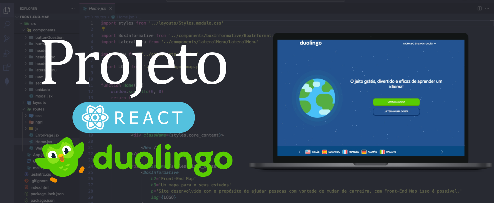
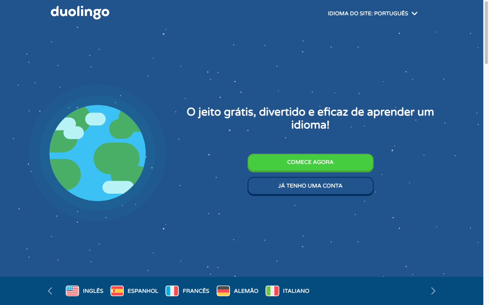
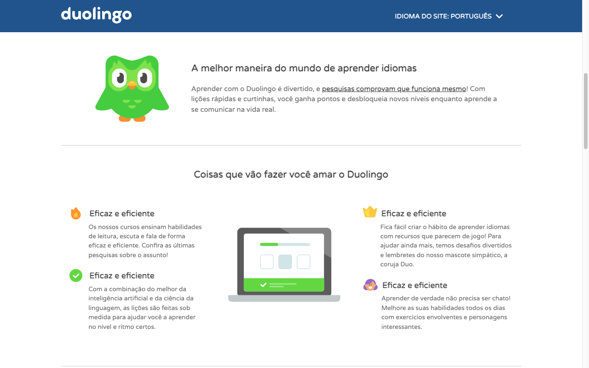
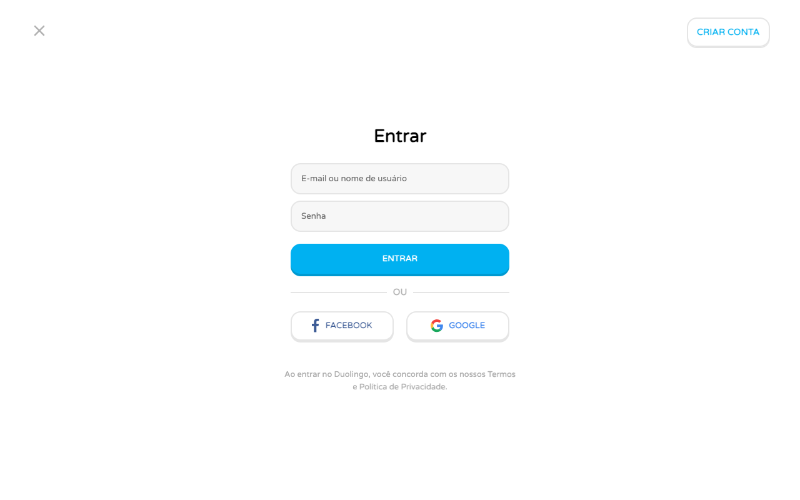

# Duolingo Clone
Copiando site Duolingo utilizando React.js

Este foi meu primerio projeto, a primeira versão dele foi feita em HTML e css, depois passei esse projeto para REACT.

## Versão 1.0

tecnologias

- HTML5
- CSS3

## Versão 2.0

tecnologias

- React
- Sass

Updates

- Responsividade

## Versão 3.0

tecnologias

- React
- CSS Modules

Updates

- Estrutura de pastas

## Versão 3.1

Updates

- Media query

## Technologies

      
      
      
      

## Screenshots

    
    
    

